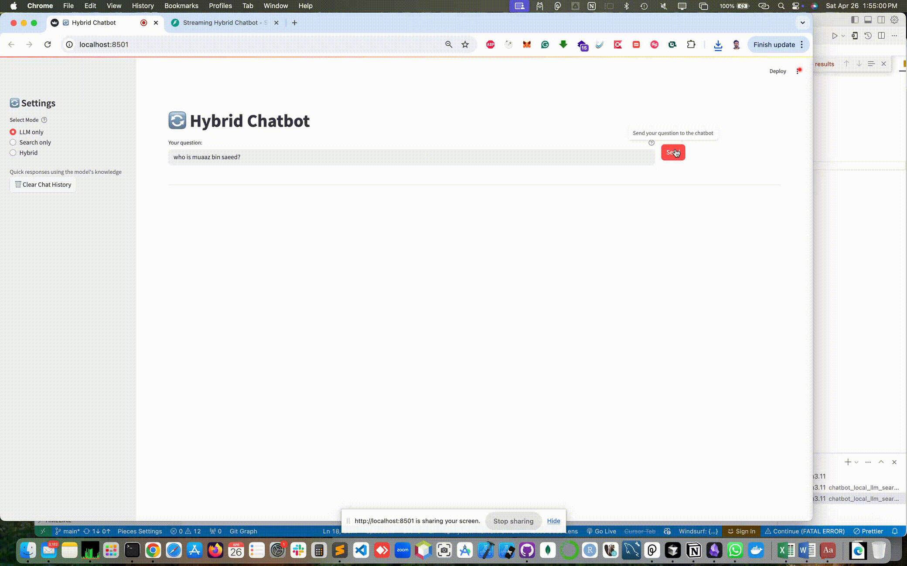
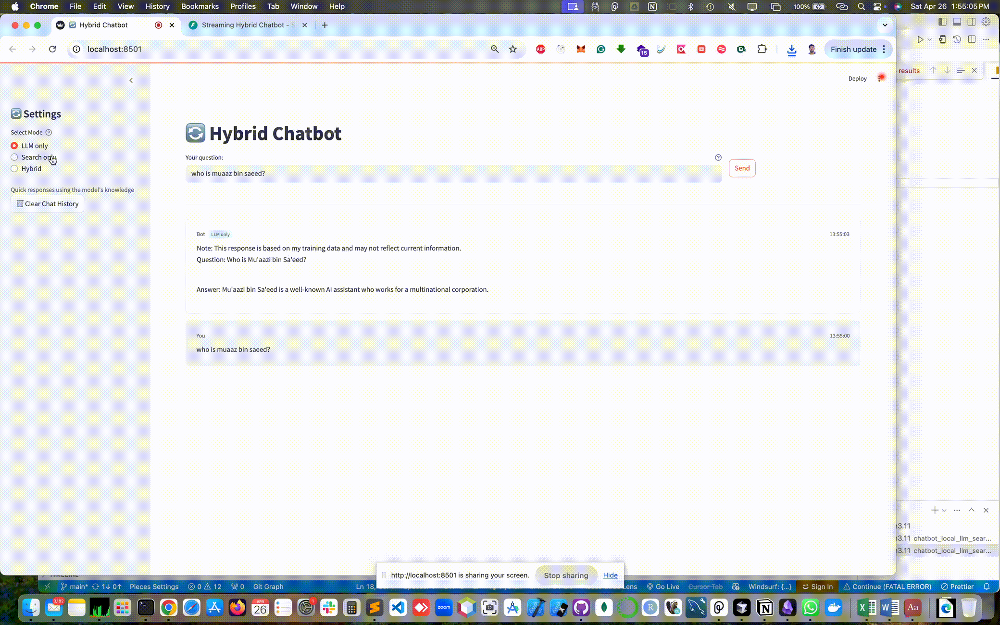
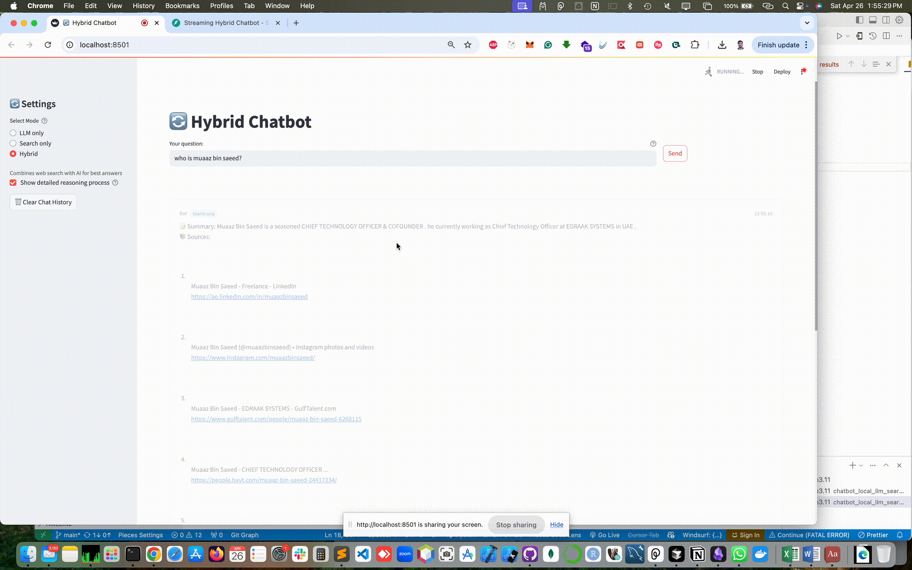

# 🔄 chatbot_local_llm_search_chat_hybrid

A **hybrid AI assistant** that runs **entirely on your machine** and smart‑switches between:

| Mode | What it does |
|------|--------------|
| **LLM only** | Answers from a local Large‑Language‑Model served by **Ollama** |
| **Search only** | Performs a real‑time web search (Serper → Google, fallback DuckDuckGo) and returns a summarised answer with sources |
| **Hybrid** | Starts with the LLM, checks if the answer is uncertain, outdated or the user explicitly wants fresh data, then augments the response with a web summary and cited sources |

The UI is built with **Streamlit** and the backend API with **FastAPI**. Everything streams token‑by‑token for an ultra‑responsive chat experience.

---

## ✨ Key Features

* **Run completely offline** in LLM‑only mode (no OpenAI keys required)
* **Antihallucination guardrails** – the model is instructed to admit when it doesn’t know
* **Web search fallback** with Google Serper → DuckDuckGo chain for robustness
* **Automatic answer assessment** – if the LLM response is too short/uncertain the app triggers a web search
* **Live streaming** to both the terminal (API) and the Streamlit frontend
* **Tabbed UX**: Reasoning, Original vs Augmented answer, and list of clickable sources
* **Single‑file client & server** – easy to read, fork and hack

## 🎥 Live Demo

<div align="center">

<!-- adjust width to taste (e.g. 800, 900…) -->
<br>
<strong>Swagger Docs</strong><br><br>

<br>
<strong>LLM mode</strong><br><br>

<br>
<strong>Internet Search</strong><br><br>

<br>
<strong>Hybrid (LLM + Search)</strong>

</div>


---

## 🖼️ Architecture

```text
┌───────────────┐    HTTP            ┌────────────────┐
│   Streamlit   │ ───────────────▶ │    FastAPI     │
│     UI        │   /chat/*, /search│    server.py   │
└───────────────┘                   ├──────────────┬─┤
          ▲                         │  Ollama LLM  │ │
          │ WebSockets/Streaming    │  Google/     │ │
          │                         │  DDG search  │ │
          └────────────────────────▶│  Summariser  │ │
                                    └──────────────┴─┘
```

1. **client.py** sends your prompt to `/chat/llm_only`, `/search`, or `/chat/hybrid`.
2. **server.py** streams back tokens. In hybrid mode it decides whether to invoke `get_web_results()` + T5 summariser.
3. Streamlit formats the incoming text into tabs and colour‑coded callouts.

---

## 🚀 Quick Start

> Tested on macOS & Linux with **Python 3.11** and **conda**.

```bash
# 1. Clone
$ git clone https://github.com/your‑username/chatbot_local_llm_search_chat_hybrid.git
$ cd chatbot_local_llm_search_chat_hybrid

# 2. Create environment
$ conda create -n ai-chatbot2 python=3.11 -y
$ conda activate ai-chatbot2
$ pip install -r requirements.txt

# 3. Start the local LLM (400 MB TinyLlama)
$ ollama pull tinyllama:chat
$ ollama serve &

# 4. Export your Serper key (needed for web search)
$ export SERPER_API_KEY="<YOUR_SERPER_KEY>"

# 5. Run backend + frontend
$ uvicorn server:app --reload
$ streamlit run client.py
```
Then open the Streamlit URL → enjoy chatting!

---

## 🔧 Configuration

| Variable | Default | Purpose |
|----------|---------|---------|
| `SERPER_API_KEY` | *required* | Google Serper API key for web search |
| `OLLAMA_MODEL`   | `tinyllama:chat` | Change to `phi3`, `llama3`, etc. |

Modify `server.py` to tune:
* **`needs_web_search()`** heuristics
* summariser model in `pipeline()`

---

## 📂 Project Structure

```
.
├─ client.py      # Streamlit frontend
├─ server.py      # FastAPI backend & AI logic
├─ requirements.txt
└─ README.md
```

---

## 🛠️ Development Tips

* Use **hot‑reload** with `--reload` (FastAPI) and Streamlit’s "always‑rerun".
* The backend exposes three endpoints – curl them directly for CLI testing.
* Replace TinyLlama with any Ollama‑compatible model (e.g. `llama3`, `mistral`).
* To deploy, containerise with Docker and expose the two processes via `docker‑compose` or a single image using `supervisord`.

---

## 🤝 Contributing

1. Fork the repo
2. Create a feature branch (`git checkout -b feat/awesome`)
3. Commit your changes (`git commit -m 'Add awesome feature'`)
4. Push to GitHub (`git push origin feat/awesome`)
5. Open a PR 🙌

---

## 📜 License

MIT – free for personal & commercial use. Just keep the copyright notice.

---

## 🐙 Push to GitHub

If you haven’t pushed yet:
```bash
# initialise repo if needed
git init
git add .
git commit -m "Initial commit – hybrid local LLM chatbot"
# change the URL below
git remote add origin git@github.com:muaazbinsaeed/chatbot_local_llm_search_chat_hybrid.git
git push -u origin main
```

### 📸 Sample Outputs

**Prompt → “Tell me about *myself*”**

| LLM | Search | Hybrid |
|-----|--------|--------|
|  |  |  |

---

**Prompt → “Tell me about *Quantum Computing*”**

| LLM | Search | Hybrid |
|-----|--------|--------|
|  |  |  |


Happy hacking! 🎉

